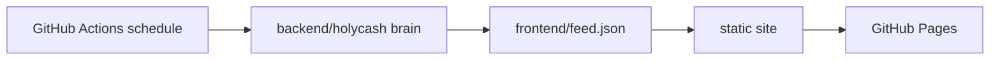

# Holy Cash Architecture

Holy Cash is intentionally simple.

## Face

`frontend/` is a static site. It can be hosted by GitHub Pages, Netlify, Vercel, or any basic web server.

## Mind

`backend/` is a Python agent. The starter version generates in-character posts locally. Later modules can add:

- DEXScreener price/liquidity reads
- Solana wallet monitoring
- X posting
- Telegram summaries
- Supabase prayer wall moderation

## Automation

`.github/workflows/deploy-pages.yml` deploys the static site. `.github/workflows/holy-cash-agent.yml` runs the agent on a schedule and commits feed updates.
